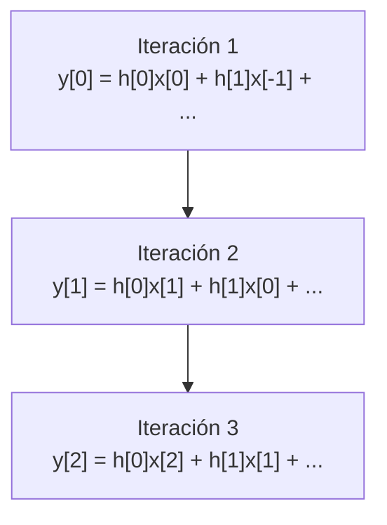
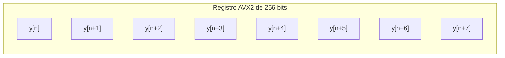
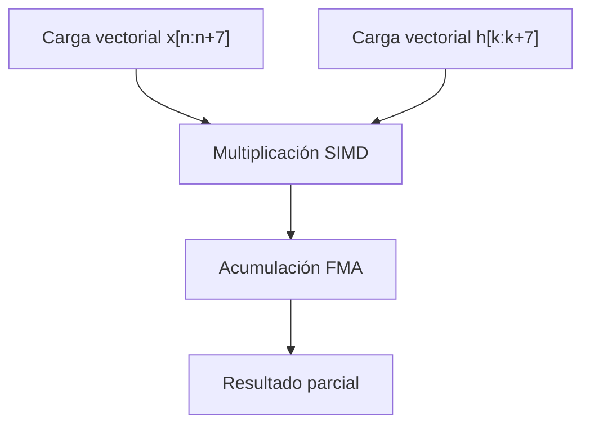
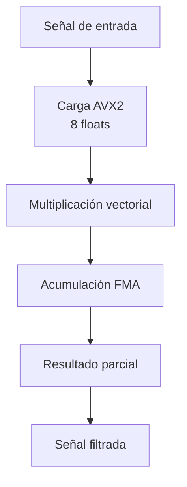
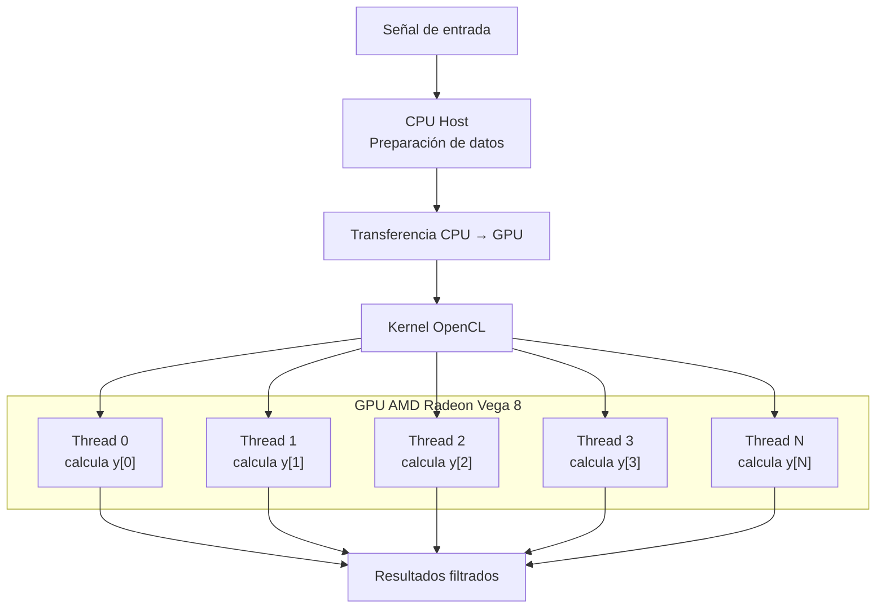
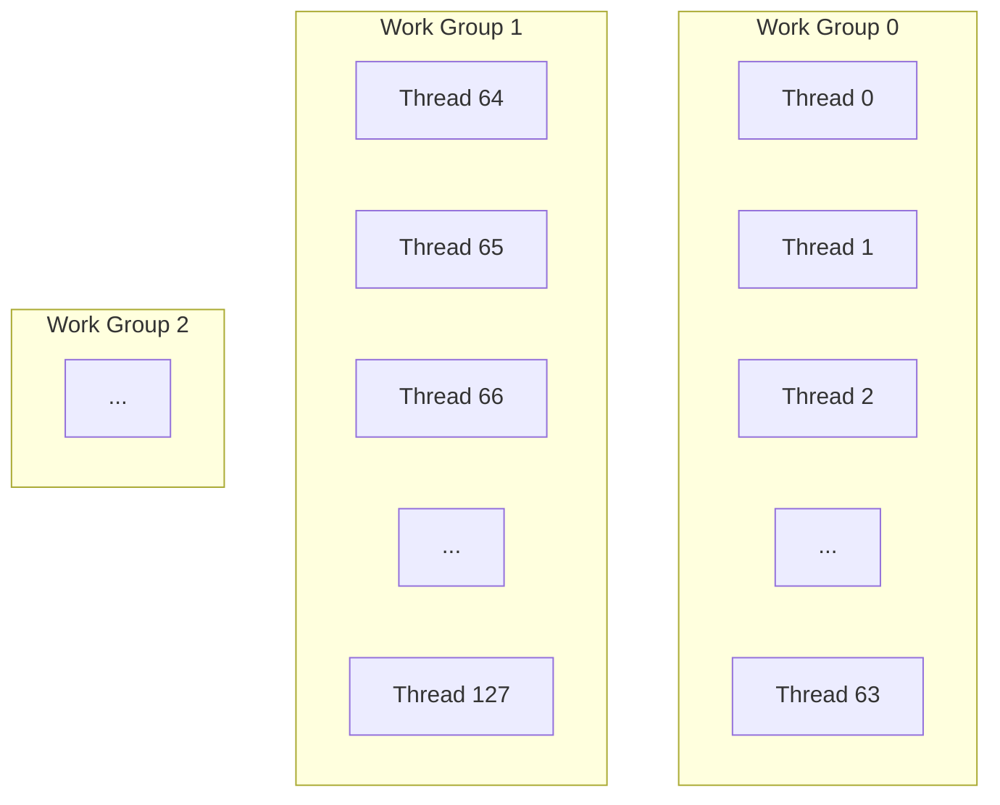

# Proyecto Grupal 2 - Arquitectura de Computadores II

## Demostración 1

## Aceleración de Filtrado FIR utilizando SIMD y GPU

---

# Descripción del problema

El problema seleccionado para el proyecto consiste en la aceleración de un sistema de filtrado digital FIR (Finite Impulse Response) aplicado sobre señales senoidales de gran tamaño utilizando paralelismo a nivel de datos (DLP).

La señal de entrada será una señal sintética generada computacionalmente, compuesta por la mezcla de múltiples componentes senoidales junto con ruido artificial. El objetivo principal será recuperar la señal de baja frecuencia mediante la aplicación de un filtro paso bajo FIR de orden alto.

La señal tendrá una gran cantidad de muestras, permitiendo explotar de manera eficiente el paralelismo SIMD en CPU y el paralelismo masivo en GPU.

La salida del filtro FIR se calcula mediante la siguiente ecuación:

$$
y[n] = \sum_{k=0}^{M-1} h[k]x[n-k]
$$

Donde:

- `x[n]` corresponde a la señal de entrada.
- `h[k]` corresponde a los coeficientes del filtro FIR.
- `y[n]` corresponde a la señal filtrada.
- `M` corresponde al orden del filtro.

---

# Fundamentación de la selección del problema

El filtrado FIR fue seleccionado debido a que posee características ideales para el estudio de arquitecturas paralelas orientadas a DLP.

## Razones principales

### 1. Alto paralelismo de datos

Cada muestra de salida `y[n]` puede calcularse independientemente de las demás, permitiendo ejecutar múltiples operaciones simultáneamente.

Esto permite aprovechar:

- SIMD sobre CPU.
- Paralelismo masivo sobre GPU.

---

### 2. Patrón computacional repetitivo

El algoritmo FIR realiza una gran cantidad de operaciones multiply-accumulate (MAC):

$$
y[n] = y[n] + h[k]x[n-k]
$$

Este patrón es ideal para:

- instrucciones vectoriales AVX2,
- operaciones FMA (Fused Multiply-Add),
- pipelines vectoriales,
- procesamiento GPU.

---

### 3. Escalabilidad del problema

El tamaño de la señal y el orden del filtro pueden incrementarse considerablemente para estudiar:

- throughput,
- uso de caché,
- ancho de banda,
- escalabilidad,
- utilización SIMD,
- comportamiento GPU.

---

### 4. Relación directa con arquitectura de computadores

El problema permite analizar:

- instrucciones SIMD AVX2,
- registros vectoriales,
- alineamiento de memoria,
- jerarquía de caché,
- paralelismo masivo GPU,
- transferencia de memoria,
- throughput computacional.

---

# Señal utilizada

La señal de entrada será generada artificialmente y estará compuesta por:

- una componente senoidal de baja frecuencia,
- una componente senoidal de alta frecuencia,
- ruido artificial.

Conceptualmente:

$$
x[n] = A_1 \sin(2\pi f_1 n) + A_2 \sin(2\pi f_2 n) + ruido
$$

El filtro FIR paso bajo buscará eliminar:

- la componente de alta frecuencia,
- el ruido agregado.

La implementación utilizará señales con millones de muestras para incrementar el paralelismo y obtener resultados representativos de desempeño.

---

# Hardware objetivo 

El hardware seleccionado corresponde a CPU+GPU, la cual para uno de los miembros del grupo corresponde a:

## CPU

- AMD Ryzen 5 3450U
- Arquitectura x86_64
- 4 núcleos / 8 hilos
- Soporte AVX2
- Soporte FMA

## GPU

- AMD Radeon Vega 8 Graphics
- OpenCL 3.0
- 8 Compute Units

## Sistema Operativo

- Ubuntu 24.04 LTS Noble Numbat

---

# Implementación SIMD sobre CPU

La implementación SIMD utilizará instrucciones AVX2 junto con operaciones FMA para procesar múltiples muestras simultáneamente.

AVX2 trabaja con registros de 256 bits, permitiendo procesar:

- 8 valores `float` simultáneamente.

La estrategia principal consistirá en calcular múltiples muestras de salida del filtro FIR en paralelo utilizando registros vectoriales AVX2.

---

# Diagrama conceptual SIMD

## Procesamiento escalar tradicional

En el procesamiento escalar tradicional, cada muestra de salida se calcula individualmente.

---

## Procesamiento SIMD AVX2

Cada registro AVX2 permite almacenar y procesar 8 valores `float` simultáneamente.

---

## Operación SIMD conceptual

La operación SIMD utilizará instrucciones FMA (Fused Multiply-Add), reduciendo la cantidad de instrucciones necesarias para realizar operaciones multiply-accumulate.

---

## Flujo general SIMD

---

# Implementación GPU mediante OpenCL

La implementación GPU utilizará OpenCL 3.0 sobre la GPU AMD Radeon Vega 8.

La estrategia consistirá en asignar el cálculo de cada muestra de salida a un thread independiente de GPU.

Cada work-item de OpenCL calculará una muestra de salida distinta del filtro FIR.

---

# Diagrama conceptual GPU

---

# Organización de work-items GPU

La arquitectura AMD utilizada posee un tamaño preferido de work-group múltiplo de 64 threads, permitiendo aprovechar de mejor manera la ejecución paralela de la GPU.

---

# Métricas relevantes

Las siguientes métricas serán utilizadas para evaluar el desempeño del sistema.

---

## 1. Tiempo de ejecución

Tiempo total requerido para aplicar el filtro FIR.

---

## 2. Speedup

Comparación entre:

* implementación secuencial,
* implementación SIMD,
* implementación GPU.

Speedup=\frac{T_{secuencial}}{T_{paralelo}}

---

## 3. Throughput

Cantidad de muestras procesadas por segundo.

Throughput=\frac{muestras}{segundo}

---

## 4. Escalabilidad

Evaluación del comportamiento del sistema variando:

* tamaño de la señal,
* orden del filtro FIR.

---

## 5. Utilización SIMD

Análisis del aprovechamiento de registros vectoriales AVX2 y operaciones FMA.

---

## 6. Comportamiento de memoria

Se analizarán métricas relacionadas con:

* caché,
* alineamiento,
* accesos a memoria,
* ancho de banda.

---

## 7. Overhead GPU

Evaluación de:

* transferencia CPU-GPU,
* costo de lanzamiento de kernels,
* eficiencia del paralelismo masivo.

---
