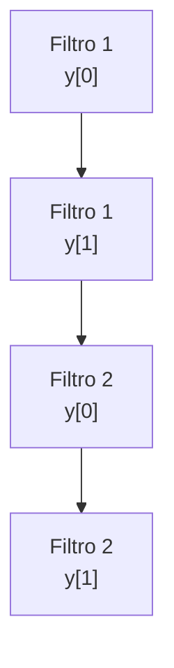
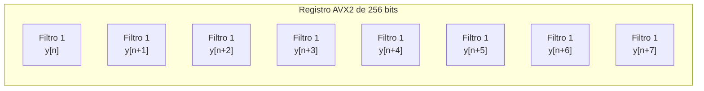
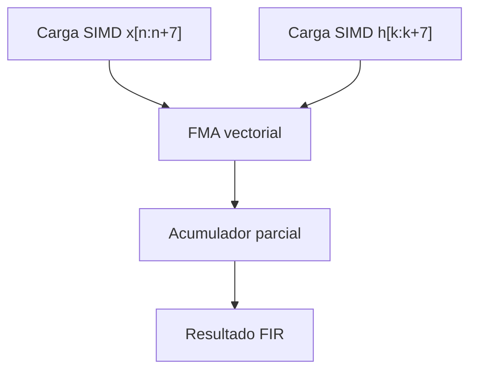
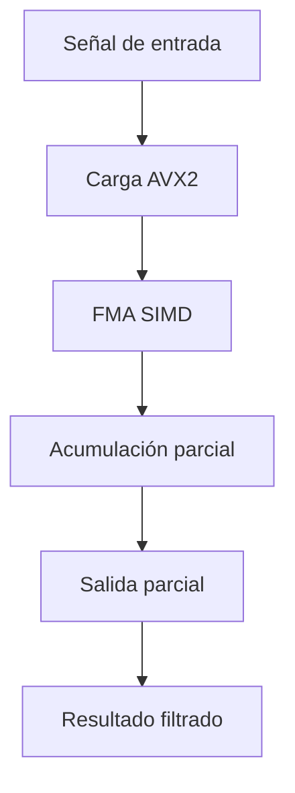
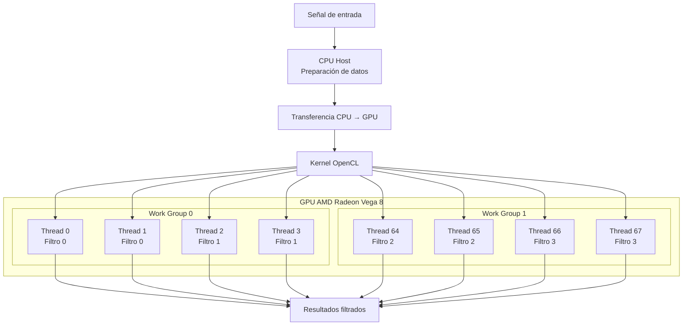
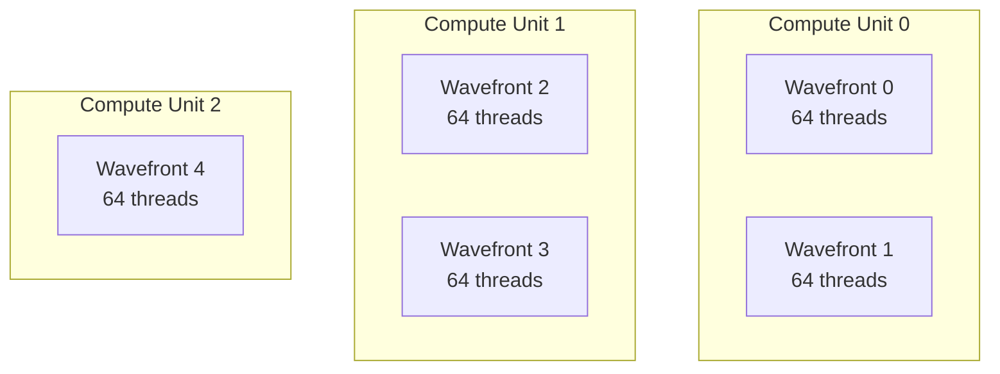

# Proyecto Grupal 2 - Arquitectura de Computadores II

## Demostración 2

# Banco de Filtros FIR utilizando SIMD y GPU

---

# Descripción del problema

El problema seleccionado para el proyecto consiste en el filtrado digital FIR (Finite Impulse Response) aplicado sobre señales senoidales de gran tamaño utilizando paralelismo a nivel de datos (DLP).

A diferencia de un filtrado FIR tradicional utilizando un único filtro, el proyecto propone implementar un banco de filtros FIR de distintos tipos y órdenes, permitiendo incrementar significativamente la carga computacional y el paralelismo explotable tanto en CPU como en GPU.

La señal de entrada será una señal sintética generada computacionalmente, compuesta por múltiples componentes senoidales junto con ruido artificial. El objetivo principal será recuperar diferentes componentes frecuenciales de la señal mediante la aplicación de múltiples filtros FIR de orden alto.

La señal tendrá millones de muestras, permitiendo explotar de manera eficiente:

- SIMD sobre CPU,
- paralelismo masivo sobre GPU,
- operaciones FMA,
- procesamiento vectorial,
- procesamiento multicanal.

La salida de cada filtro FIR se calcula mediante la siguiente ecuación:

$$
y[n] = \sum_{k=0}^{M-1} h[k]x[n-k]
$$

Donde:

- `x[n]` corresponde a la señal de entrada.
- `h[k]` corresponde a los coeficientes del filtro FIR.
- `y[n]` corresponde a la señal filtrada.
- `M` corresponde al orden del filtro.

Cada filtro del banco tendrá coeficientes distintos dependiendo del comportamiento frecuencial deseado.

---

# Fundamentación de la selección del problema

El banco de filtros FIR fue seleccionado debido a que posee características ideales para el estudio de arquitecturas paralelas orientadas a DLP y procesamiento heterogéneo CPU-GPU.

---

# Razones principales

## 1. Alto paralelismo de datos

Cada muestra de salida de cada filtro puede calcularse independientemente de las demás, permitiendo ejecutar múltiples operaciones simultáneamente.

Esto permite aprovechar:

- SIMD sobre CPU,
- paralelismo masivo sobre GPU,
- múltiples work-items OpenCL,
- pipelines vectoriales.

El problema posee paralelismo tanto:

- entre muestras,
- como entre filtros.

---

## 2. Patrón computacional repetitivo

El algoritmo FIR realiza una gran cantidad de operaciones multiply-accumulate (MAC):

$$
y[n] = y[n] + h[k]x[n-k]
$$

Este patrón es ideal para:

- instrucciones vectoriales AVX2,
- operaciones FMA (Fused Multiply-Add),
- pipelines SIMD,
- procesamiento GPU,
- paralelismo masivo.

La operación FMA utilizada conceptualmente corresponde a:

$$
a \cdot b + c
$$

La utilización de FMA reduce la cantidad total de instrucciones y mejora el throughput computacional.

---

## 3. Incremento de carga computacional

La implementación de múltiples filtros FIR incrementa considerablemente la cantidad de operaciones realizadas sobre la señal.

Esto permite:

- incrementar el paralelismo explotable,
- aumentar el arithmetic intensity,
- reducir el impacto relativo de transferencia CPU-GPU,
- justificar el uso de GPU,
- estudiar comportamiento escalable.

---

## 4. Escalabilidad del problema

El problema puede escalar aumentando:

- tamaño de la señal,
- cantidad de filtros,
- orden de los filtros FIR.

Esto permite estudiar:

- throughput,
- uso de caché,
- ancho de banda,
- utilización SIMD,
- occupancy GPU,
- eficiencia del paralelismo masivo,
- overhead CPU-GPU.

---

## 5. Relación directa con arquitectura de computadores

El problema permite analizar múltiples conceptos fundamentales de arquitectura de computadores y procesamiento paralelo:

- instrucciones SIMD AVX2,
- registros vectoriales,
- operaciones FMA,
- alineamiento de memoria,
- jerarquía de caché,
- work-items OpenCL,
- work-groups,
- wavefronts AMD,
- transferencia CPU-GPU,
- throughput computacional.

---

# Señal utilizada

La señal de entrada será generada artificialmente y estará compuesta por:

- múltiples componentes senoidales,
- componentes de alta frecuencia,
- componentes de baja frecuencia,
- ruido artificial.

Conceptualmente:

$$
x[n] = A_1 \sin(2\pi f_1 n) + A_2 \sin(2\pi f_2 n) + ruido
$$

El banco de filtros FIR permitirá:

- recuperar componentes específicas,
- eliminar ruido,
- separar bandas frecuenciales,
- estudiar distintos comportamientos frecuenciales.

La implementación utilizará señales con millones de muestras para incrementar el paralelismo y obtener resultados representativos de desempeño.

---

# Banco de filtros FIR

El sistema utilizará múltiples filtros FIR simultáneamente.

Entre los filtros considerados se encuentran:

- filtros paso bajo,
- filtros paso alto,
- filtros pasa banda,
- filtros notch.

Cada filtro tendrá distintos coeficientes y posiblemente distintos órdenes.

Esto incrementa significativamente:

- cantidad de operaciones,
- paralelismo explotable,
- carga computacional,
- uso eficiente de GPU.

---

# Hardware objetivo

El hardware seleccionado corresponde a una arquitectura heterogénea CPU+GPU.

## CPU

- AMD Ryzen 5 3450U
- Arquitectura x86_64
- 4 núcleos / 8 hilos
- Soporte AVX2
- Soporte FMA

## GPU

- AMD Radeon Vega 8 Graphics
- OpenCL 3.0
- 8 Compute Units
- Arquitectura basada en wavefronts de 64 threads

## Sistema Operativo

- Ubuntu 24.04 LTS Noble Numbat

---

# Implementación SIMD sobre CPU

La implementación SIMD utilizará instrucciones AVX2 junto con operaciones FMA para procesar múltiples muestras simultáneamente.

AVX2 trabaja con registros de 256 bits, permitiendo procesar:

- 8 valores `float` simultáneamente.

La estrategia principal consistirá en calcular múltiples muestras de salida de múltiples filtros FIR en paralelo utilizando registros vectoriales AVX2.

---

# Diagrama conceptual SIMD

## Procesamiento escalar tradicional

En el procesamiento escalar tradicional, cada muestra se calcula individualmente.

---

## Procesamiento SIMD AVX2

Cada registro AVX2 permite procesar simultáneamente múltiples muestras del filtro FIR.

---

## Operación SIMD conceptual

La operación FMA permite realizar multiplicación y acumulación en una sola instrucción vectorial.

---

## Flujo general SIMD

---

# Implementación GPU mediante OpenCL

La implementación GPU utilizará OpenCL 3.0 sobre la GPU AMD Radeon Vega 8.

La estrategia consistirá en asignar el cálculo de muestras y filtros distintos a múltiples work-items ejecutados de forma paralela.

Cada work-item de OpenCL calculará una muestra específica para un filtro específico.

---

# Diagrama conceptual GPU

---

# Organización de work-items GPU

La arquitectura AMD Radeon Vega ejecuta threads en grupos denominados wavefronts de 64 threads.

Por esta razón, los tamaños de work-group utilizados buscarán ser múltiplos de 64 para maximizar utilización y occupancy de GPU.

---

# Transferencia CPU-GPU

Uno de los aspectos importantes del proyecto será estudiar el impacto de transferencia de datos entre CPU y GPU.

La ejecución GPU incluye:

- transferencia de señal CPU -> GPU,
- ejecución de kernels OpenCL,
- transferencia GPU -> CPU.

El proyecto analizará el impacto del overhead de migración de datos y cómo éste afecta el speedup total del sistema.

---

# Métricas relevantes

Las siguientes métricas serán utilizadas para evaluar el desempeño del sistema.

---

## 1. Tiempo de ejecución

Tiempo total requerido para aplicar el banco de filtros FIR.

---

## 2. Speedup

Comparación entre:

- implementación secuencial,
- implementación SIMD,
- implementación GPU.

$$
Speedup = \frac{T_{secuencial}}{T_{paralelo}}
$$

---

## 3. Throughput

Cantidad de muestras procesadas por segundo.

$$
Throughput = \frac{muestras}{segundo}
$$

---

## 4. Escalabilidad

Evaluación del comportamiento del sistema variando:

- tamaño de la señal,
- orden de los filtros,
- cantidad de filtros FIR.

---

## 5. Utilización SIMD

Análisis del aprovechamiento de:

- registros vectoriales AVX2,
- operaciones FMA,
- pipelines SIMD.

---

## 6. Occupancy GPU

Análisis del aprovechamiento de:

- compute units,
- work-groups,
- wavefronts AMD,
- paralelismo masivo.

---

## 7. Comportamiento de memoria

Se analizarán métricas relacionadas con:

- caché,
- alineamiento,
- accesos a memoria,
- ancho de banda,
- transferencia CPU-GPU.

---

## 8. Overhead GPU

Evaluación de:

- transferencia CPU-GPU,
- costo de lanzamiento de kernels,
- eficiencia del paralelismo masivo,
- impacto del movement de datos.
